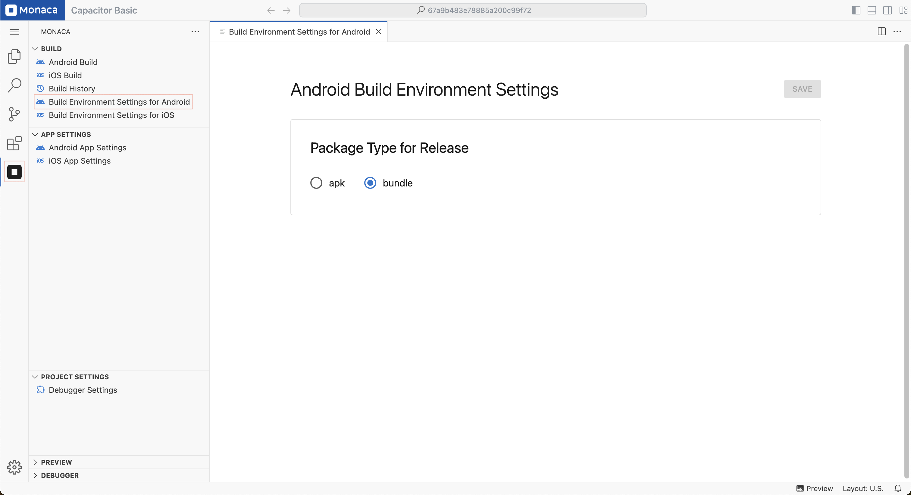

# Android Build Environment Setting

You can set the environment settings for building Capacitor android applications. The settings are project-specific.

1. Open the **Build Environment Settings for Android** page:  
   - Click the **Monaca** icon in the **Activity Bar**.  
   - Under the **"Build"** section, select **Build Environment Settings for Android**.

2. The page will appear as shown below. You can then start your configuration.

3. After finishing the configuration, click **"Save"**.

  

    - **Package Type:**  
        - Choose the output package format for the Android build:
            - **APK:** A standard Android application package.
            - **App Bundle:** A more optimized package format recommended for **Google Play Store distribution**.

---

## Notes

- This page is only for Capacitor projects.
- Some settings may vary depending on the Capacitor version.
