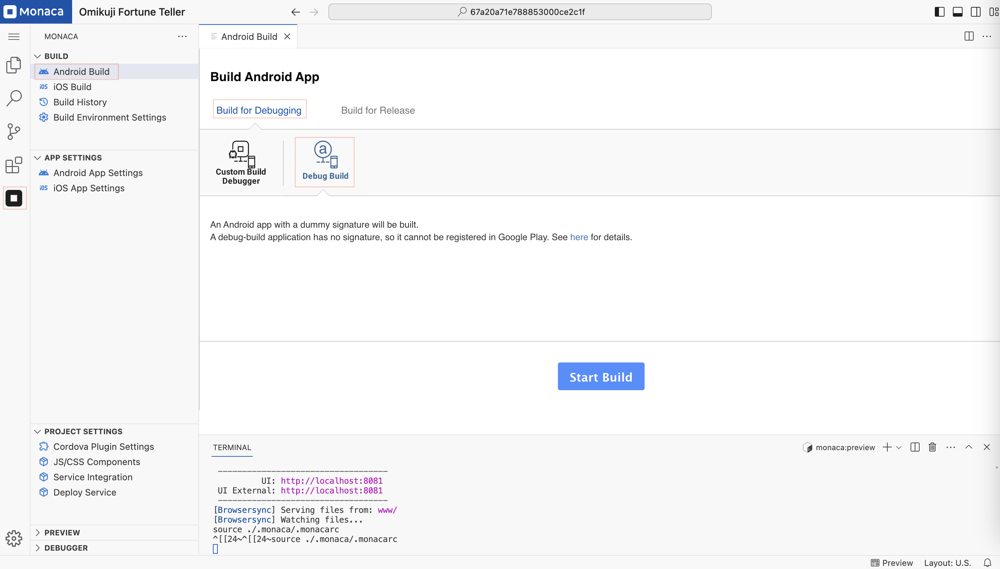
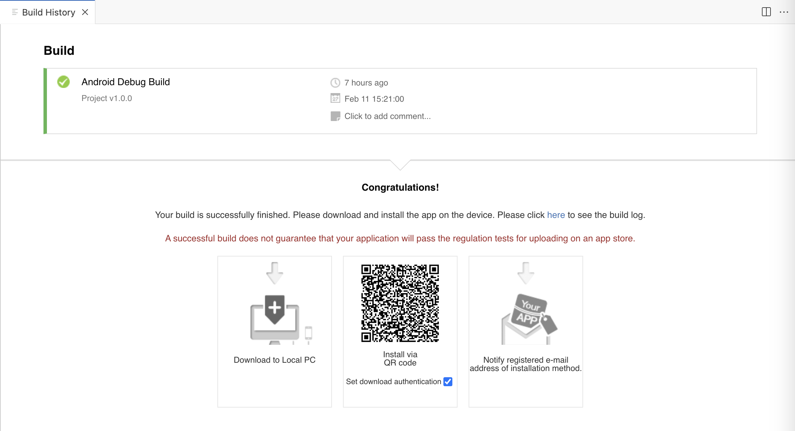
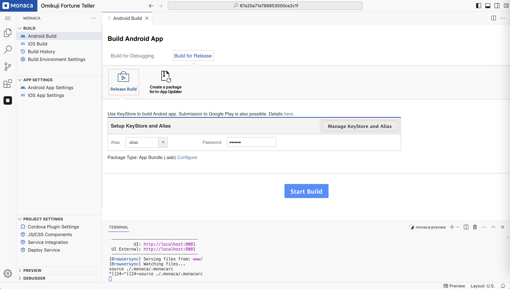
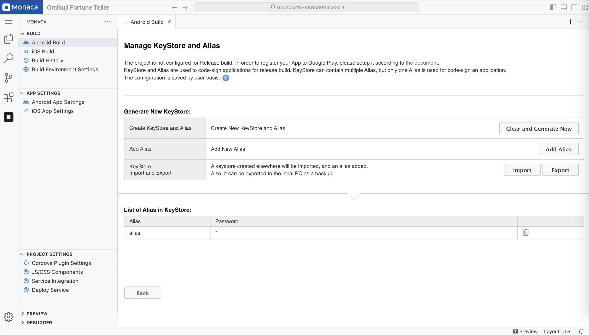

# Android Build

## Types of Builds

In Monaca, an Android app can be built in two different modes: **Debug** and **Release**. The key differences between these build types are as follows:

| Type of Build   | Description                                                                            |
| --------------- | -------------------------------------------------------------------------------------- |
| Debug Build     | An unsigned package that cannot be distributed in the market.                         |
| Release Build   | A signed package with the developer’s code signature, allowing distribution in the market. |

---

## Debug Build

To initiate a **Debug Build**, follow these steps:

1. Open the **Android Build** page:  
   - Click the **Monaca** icon in the **Activity Bar**.  
   - Under the **"Build"** section, select **Android Build**.

    

2. On the build page, choose **"Build for Debugging"** and select **"Debug Build"**.  
   Then, click **"Start Build"** to begin the process.

3. Once the build is completed successfully, you can install the app on your device by either:
   - Downloading the file to your local PC.  
   - Scanning the QR code for direct installation.

    

---

## Release Build

A **KeyStore** is a binary file containing a set of private keys, which are used to sign the application.  
A private key identifies the entity associated with the app, such as an individual or a company.  

### Important Notes

- A **KeyStore** is encrypted with a password that **cannot be recovered if lost**.  
- If a KeyStore is lost or overwritten, it becomes **impossible to use the same key** for re-signing the app.  
- A **KeyStore** is required to build a **release version** of your Android app.

### Steps to Build a Release Version

1. Open the **Android Build** page and select **"Build for Release"**.

    

2. If you do not have a KeyStore, click **"Manage KeyStore and Alias"** to create a new key.

    

3. Once the KeyStore is created, return to the **Build** page and start the release build.

4. After a successful release build, you can:  
   - Download the file.  
   - Upload the file to the **Google Play Store** for distribution.
