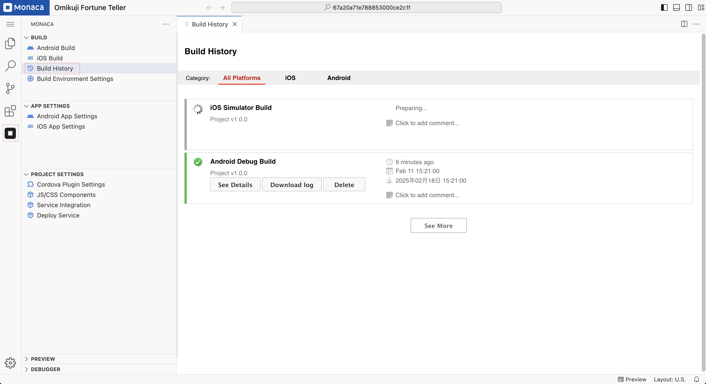

# Build History

Every time you build your app in the Monaca IDE, Monaca saves your build history where you can see your build details and error logs.

Open the **Build History** page:  

- Click the **Monaca** icon in the **Activity Bar**.  
- Under the **"Build"** section, select **Build History**.

It will list all in-progress, successful, and failed builds for iOS and Android.  

You can click **"See Details"** to navigate to the build results page for detailed build information,   **"Download Log"** to download the build log for checking or debugging, or **"Delete"** to remove the build from the list.
