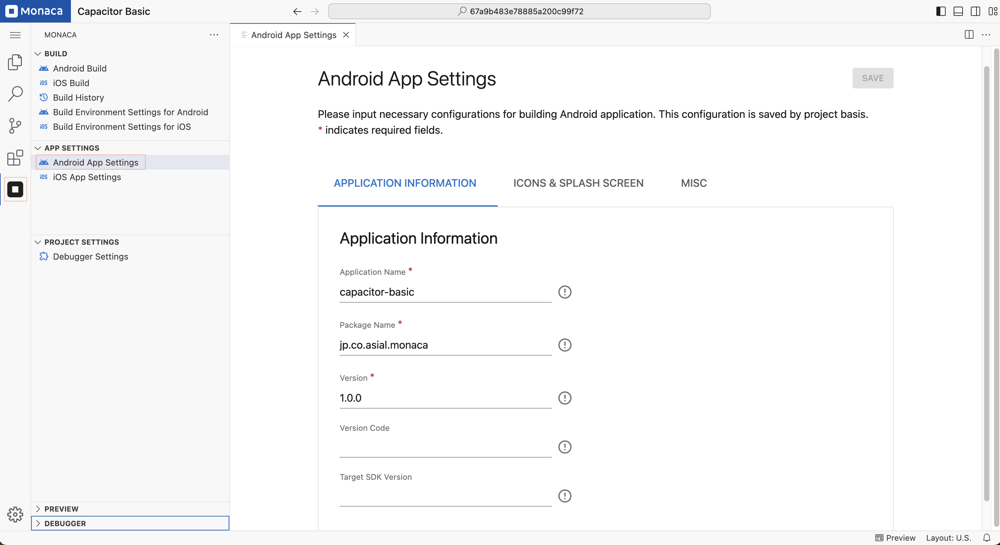

# Android App Setting

There are 2 ways to configure your Android apps:

- Configure via the IDE
- Configure via configuration files directly

## Configure via the IDE

The Android App Settings page allows to set several commonly used parameter in Android app. Please follow the following instruction in order to access the Android App Setting page in the IDE:

1. Open the **Android App Settings** page:  
   - Click the **Monaca** icon in the **Activity Bar**.  
   - Under the **"App Settings"** section, select **Android App Settings**.

2. On the **Android App Settings** page, page will appear as shown below. You can then start your configuration.

3. After finishing the configuration, click **"Save"**.

    

### Configurable Parameters

In the Android App Settings page, you can configure the parameters such as application information, icons, splash files, permissions and additional features. The following are the list of parameters can be configured via the page:

#### Application Information

The **Application Information** section allows you to configure essential details for your Android app.

- **Application Name (Required):**  
  - The name of your application that will appear on the device's home screen.

- **Package Name (Required):**  
  - A unique identifier for your app (e.g., `jp.co.asial.monaca`).  
  - This must follow the **reverse domain name format**.

- **Version (Required):**  
  - The version number of your app (e.g., `1.0.0`).  
  - This follows **semantic versioning** (`major.minor.patch`).

- **Version Code:**  
  - A numeric value that increases with each app release.  
  - This is used by Google Play Store to identify updates.  
  - If left blank, the system will automatically assign a version code.

- **Target SDK Version:**  
  - Defines the Android API level your app targets.  
  - If left blank, Monaca will set a default version.

---

#### Icons & Splash Screen Configuration

The **Icons & Splash Screen** section allows you to upload and manage your app’s icons and splash screen.

- **App Icon:**  
  - Upload an **App Icon** in **PNG or SVG format**.  
  - Recommended size: **1024 × 1024 px**.
  - Click **Change** to update the icon.

- **Splash Screen:**  
  - Upload a **Splash Screen Image** that appears when launching the app.  
  - The **app icon with a background color** is usually displayed as a splash screen.  
  - If no background color is set, the icon may be displayed as is on Android 11 or earlier.

- **Background Color:**  
  - Set a **background color** for the **App Icon** and **Splash Screen**.
  - Choose **"None"** if no background is required.

---

#### Miscellaneous Settings

The **Misc** section provides additional configurations for your app.

- **Screen Orientation:**  
  - Defines how the app is displayed on the device.
  - Options:
    - **Default:** The app follows the device's orientation settings.
    - **Landscape:** Forces the app to run in landscape mode.
    - **Portrait:** Forces the app to run in portrait mode.

---

## Configure via configuration files

All the configuration parameters of an Android app are stored in the files as follows:

- [Capacitor Config](https://capacitorjs.com/docs/config#example)
- [Trapeze Config](https://trapeze.dev/docs/Frameworks/capacitor)

---

## Notes

- Some settings apply to both Android and iOS.
