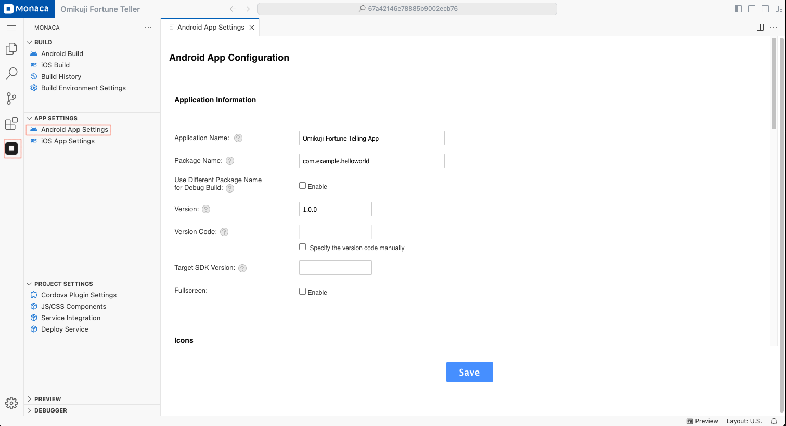

# Android App Setting

There are 2 ways to configure your Android apps:

- Configure via the IDE
- Configure via configuration files directly

## Configure via the IDE

The Android App Settings page allows to set several commonly used parameter in Android app. Please follow the following instruction in order to access the Android App Setting page in the IDE:

1. Open the **Android App Settings** page:  
   - Click the **Monaca** icon in the **Activity Bar**.  
   - Under the **"App Settings"** section, select **Android App Settings**.

2. On the **Android App Settings** page, page will appear as shown below. You can then start your configuration.

3. After finishing the configuration, click **"Save"**.

    

### Configurable Parameters

In the Android App Settings page, you can configure the parameters such as application information, icons, splash files, permissions and additional features. The following are the list of parameters can be configured via the page:

#### Application Information

The **Application Information** section allows you to configure essential details for your Android app.

- **Application Name:**  
  - The name of your application that will appear on the device's home screen.

- **Package Name:**  
  - A unique identifier for your app (e.g., `com.example.helloworld`).  
  - This must follow the **reverse domain name format**.

- **Use Different Package Name for Debug Build:**  
  - If checked, you can set a different **package name** for debugging builds to distinguish them from production versions.

- **Version:**  
  - The version number of your app (e.g., `1.0.0`).  
  - This follows **semantic versioning** (`major.minor.patch`).

- **Version Code:**  
  - A numeric value that increases with each app release.  
  - This is used by Google Play Store to identify updates.  
  - If you check **"Specify the version code manually"**, you can set this value manually.

- **Target SDK Version:**  
  - Defines the Android API level your app targets.  
  - If left blank, Monaca will set a default version.

- **Fullscreen:**  
  - If checked, the app will run in **full-screen mode**, hiding the **status bar**.

---

#### Icons Configuration

The **Icons** section allows you to upload and manage your app’s icons.

- **Upload Button:**  
  - Allows you to upload an icon image in **PNG format** to apply to all sizes at once.

- **Change Buttons:**  
  - Lets you **manually** upload different icons for various resolutions

---

#### Splash Screen Configuration

The **Splash Screen** section lets you set the launch screen that appears when the app starts.

- **Splash Screen Type:**  
  - **Size Specified Mode:** The splash screen will use the **exact dimensions** of the uploaded image.  
  - **Auto Resize Mode:** The splash screen will **automatically scale** to fit the screen size.

- **Change / Clear Buttons:**  
  - **Change:** Allows you to upload a custom splash screen image.  
  - **Clear:** Removes the currently set splash screen.

- **Splash Background Color:**  
  - Sets the **background color** of the splash screen in **hex format** (e.g., `#ffffff` for white).

- **Display Time:**  
  - Specifies how long (in milliseconds) the splash screen remains visible before the app launches.  
  - Default: `1000` ms (1 second).

---

#### Miscellaneous Settings

The **Misc** section provides additional configurations for your app.

- **Allowed URL:**  
  - Defines which URLs the app can access.  
  - Use `*` to allow all URLs.  

- **Keep Running:**  
  - If enabled, the app will keep running in the background when minimized.

- **Disallow Overscroll:**  
  - If enabled, **elastic scrolling** (bounce effect when scrolling) will be disabled.

- **Screen Orientation:**  
  - **Default:** The app will follow the device’s default orientation.  
  - **Landscape:** Forces the app to run in landscape mode.  
  - **Portrait:** Forces the app to run in portrait mode.

## Configure via configuration files

All the configuration parameters of an Android app are stored in the files as follows:

- [config.xml](https://cordova.apache.org/docs/en/dev/config_ref/index.html)

---

## Notes

- Some settings apply to both Android and iOS.
