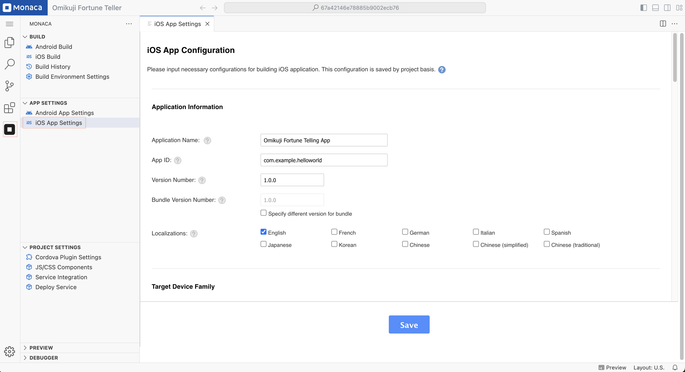

# iOS App Setting

There are 2 ways to configure your iOS apps:

- Configure via the IDE
- Configure via configuration files directly

## Configure via the IDE

The iOS App Settings page allows to set several commonly used parameter in iOS app. Please follow the following instruction in order to access the iOS App Setting page in the IDE:

1. Open the **iOS App Settings** page:  
   - Click the **Monaca** icon in the **Activity Bar**.  
   - Under the **"App Settings"** section, select **iOS App Settings**.

2. On the **iOS App Settings** page, page will appear as shown below. You can then start your configuration.

3. After finishing the configuration, click **"Save"**.

    

### Configurable Parameters

In the iOS App Settings page, you can configure the parameters such as application information, icons, splash files, permissions and additional features. The following are the list of parameters can be configured via the page:

#### Application Information

The **Application Information** section allows you to configure essential details for your iOS app.

- **Application Name:**  
  - The name of your application that will appear on the device's home screen.

- **App ID:**  
  - A unique identifier for your app (e.g., `com.example.helloworld`).  
  - This must follow the **reverse domain name format**.

- **Version Number:**  
  - The version number of your app (e.g., `1.0.0`).  
  - This follows **semantic versioning** (`major.minor.patch`).

- **Bundle Version Number:**  
  - A numeric value that increases with each app release.  
  - If you check **"Specify different version for bundle"**, you can set this value manually.

- **Localizations:**  
  - Specifies which languages your app supports.  
  - Select one or more from **English, French, German, Italian, Spanish, Japanese, Korean, Chinese (simplified), and Chinese (traditional)**.

---

#### Target Device Family

The **Target Device Family** section lets you choose the devices your app will support.

---

#### Icons Configuration

The **Icons** section allows you to upload and manage your app’s icons.

- **Upload Button:**  
  - Allows you to upload an icon image in **PNG format** to apply to all sizes at once.

- **Change Buttons:**  
  - Lets you **manually** upload different icons for various resolutions.

---

#### Icons for App Store

The **App Store Icon** section allows you to set the required **1024 × 1024 px** app icon for publishing.

---

#### Splash Screen Configuration

The **Splash Screen** section lets you set the launch screen that appears when the app starts.

- **Splash Screen Type:**  
  - **Legacy:** Legacy splash screen configuration requires a separate image for each size of iOS device. Monaca can generate all the correct sizes for you from one image, or you can upload them individually. However, this does not support devices such as iPhone X.
  - **Storyboard (Recommended):** A storyboard splash screen uses one image for all screen sizes and crops it as necessary. You must use a storyboard to create full-screen apps on iPhone X.

- **Change Button:**  
  - Allows you to upload a custom splash screen image.

---

#### Splash Screen Settings

- **Hide By:**  
  - Specifies how the splash screen hides. Default: **Hide Automatically**.

- **Fade Splash Screen:**  
  - If enabled, the splash screen will fade out instead of disappearing abruptly.

- **Show Splash Screen Spinner:**  
  - If enabled, a loading spinner will appear on the splash screen.

---

#### Miscellaneous Settings

The **Misc** section provides additional configurations for your app.

- **Allowed URL:**  
  - Defines which URLs the app can access.  
  - Use `*` to allow all URLs.

- **Disallow Overscroll:**  
  - If enabled, **elastic scrolling** (bounce effect when scrolling) will be disabled.

- **Screen Orientation:**  
  - **All:** Supports all orientations.  
  - **Portrait:** Locks the app to portrait mode.  
  - **Landscape:** Locks the app to landscape mode.

---

## Configure via configuration files

All the configuration parameters of an iOS app are stored in the files as follows:

- [config.xml](https://cordova.apache.org/docs/en/dev/config_ref/index.html)

## Notes

- Some settings apply to both Android and iOS.
