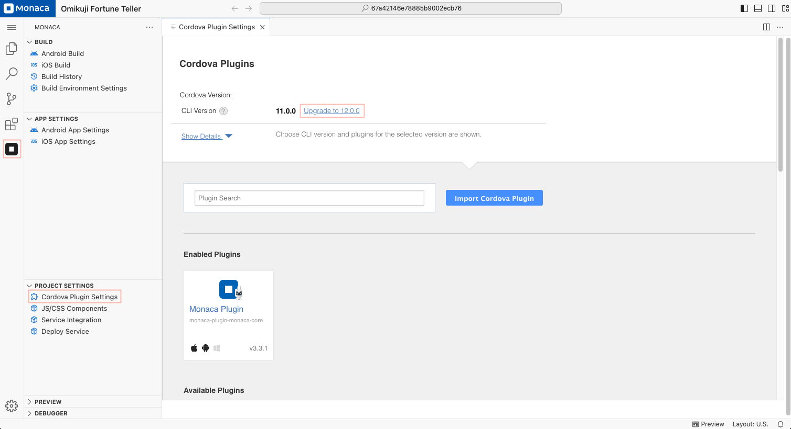
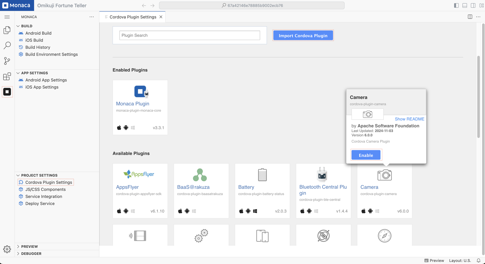
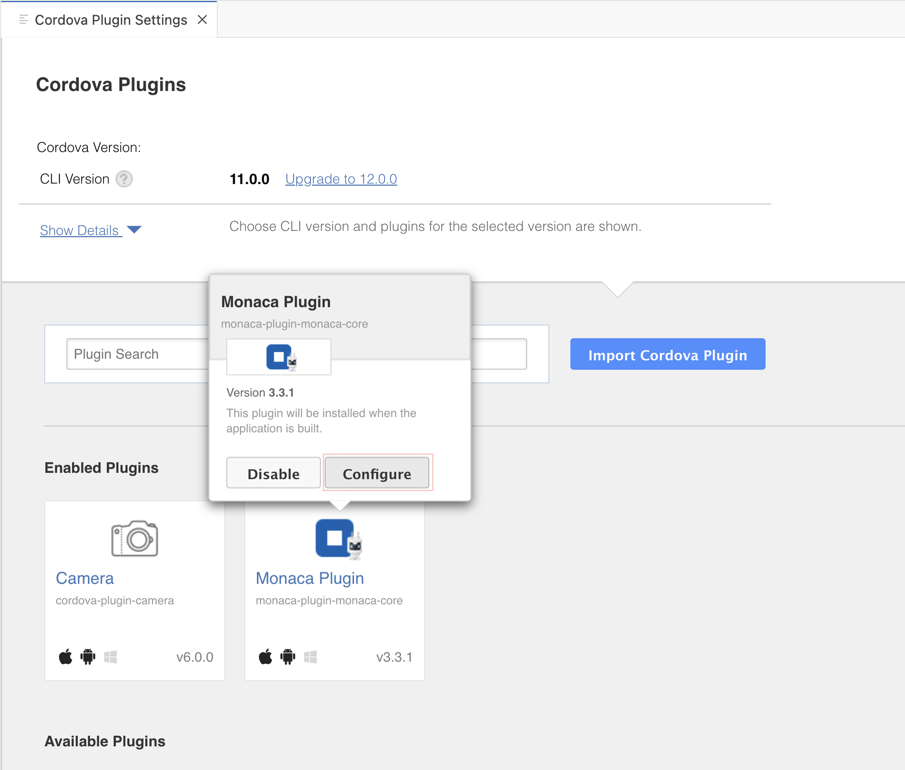
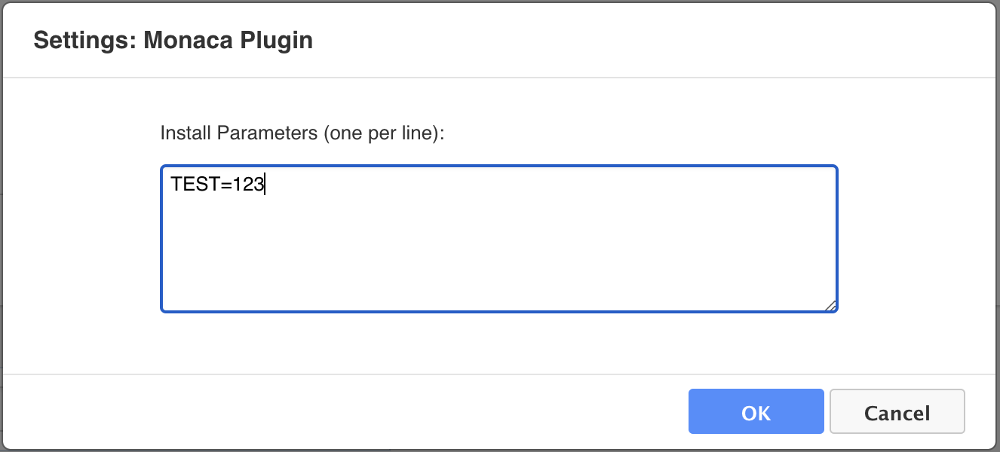

# Cordova Plugin Setting

## Cordova Plugins

Usually, you need native code (Java for Android, Objective-C for iOS, etc) to access native device functions such as camera, file system, storage, etc. However, you can access these native functions using JavaScript with Cordova.

Cordova is a set of device APIs that allow a mobile app developer to access native device functions such as the camera or accelerometer from JavaScript. Therefore, Monaca uses Cordova to enable hybrid apps to access native device functions from JavaScript.

For more information about Cordova, please refer to [here](https://cordova.apache.org/).

## Loading Cordova

You can’t use device APIs (Cordova plugins) before Cordova is fully loaded. The `deviceready` event fires once Cordova has fully loaded. Once the event fires, you can safely make calls to Cordova APIs. Applications typically attach an event listener with `document.addEventListener` once the HTML document’s DOM has loaded.

As an example, let’s start up the camera function by using Camera APIs. Please copy and paste the code below to your project in Monaca Cloud IDE. Then you can run it on `Monaca Debugger` or mobile phone devices.

```html
<!DOCTYPE HTML>
<html>
<head>
  <meta charset="utf-8">
  <meta name="viewport" content="width=device-width, initial-scale=1, maximum-scale=1, user-scalable=no">
  <meta http-equiv="Content-Security-Policy" content="default-src * data: gap: content: https://ssl.gstatic.com; style-src * 'unsafe-inline'; script-src * 'unsafe-inline' 'unsafe-eval'">
  <script src="components/loader.js"></script>
  <link rel="stylesheet" href="components/loader.css">
  <link rel="stylesheet" href="css/style.css">
  <script>
    document.addEventListener ("deviceready", onDeviceReady, false);

    //these functions runs when Cordova is ready
    function onDeviceReady () {
      alert ('Cordova is ready!');
    }

    function snapPicture () {
      navigator.camera.getPicture (successCallback, FailCallback, {destinationType: Camera.DestinationType.DATA_URL});

      //Success Callback
      function successCallback (imageData) {
        //Display image
        var image = document.getElementById ('picture');
        image.src = "data:image/jpeg;base64, " + imageData;
      }

      //Error CallBack
      function FailCallback (message) {
        alert ('Error!!!: ' + message);
      }
    }
  </script>
</head>
<body>
  <h1>Camera Sample</h1>
  <input type="button" onclick="snapPicture()" value="Snap" ><br><br>
  
</body>
</html>
```

## Upgrading the Cordova version

> The Cordova version in Monaca cannot be downgraded.

> When upgrading a Cordova version, a backup of the project is automatically created before the conversion.

When creating a new project, the latest Cordova version available in Monaca will be automatically applied.

To upgrade the **Cordova version** of your project, follow these steps:

1. Open the **Cordova Plugin Settings** page:  
   - Click the **Monaca** icon in the **Activity Bar**.  
   - Under the **"Project Settings"** section, select **"Cordova Plugin Settings"**.

2. On the **Cordova Plugins** page, your project's **current Cordova version** will be displayed.  
   - If an upgrade is available, the next version will be shown next to it.  
   - Click on the version number and follow the on-screen instructions to upgrade your project to the latest **Cordova version**.



## Importing Cordova plugins

On this page, core and some third-party Cordova plugins are listed. Mouseover a plugin and click **"Enable"** to add the plugin. If you cannot find the plugin you want in the list, you can import other third-party Cordova plugins by using the **"Import Cordova Plugin"** button.



Once a plugin is enabled/imported, you might want to configure it. Mouseover a plugin you want to configure and click **"Configure"** to open the plugin’s settings dialog where you can change the plugin’s version and set the plugin’s parameters.




