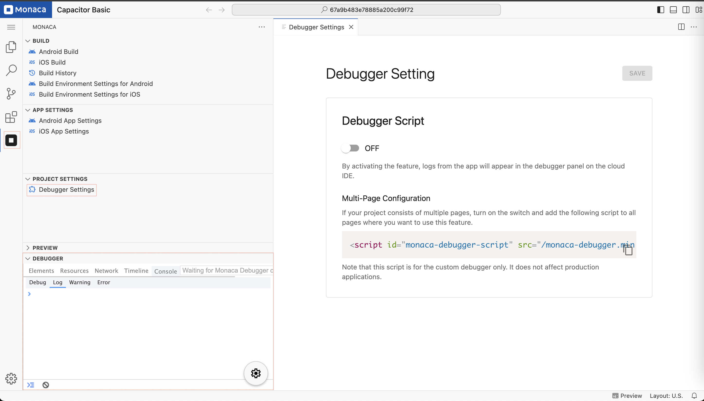

# Monaca Debugger Settings

This guide provides instructions on how to configure and use the **Debugger Settings** in **Monaca Cloud IDE**.

---

## 1. Overview

The **Debugger Settings** allow you to enable debugging features for your Capacitor project. When enabled, logs from your app will be displayed in the **Debugger Panel** within the **Cloud IDE**, making it easier to identify issues and debug your application.

---

## 2. Enabling the Debugger Script

To enable debugging for your project, follow these steps:

1. Click the **Monaca** icon in the **Activity Bar**.  
2. Under the **"Project Settings"** section, select **"Cordova Plugin Settings"**.
3. Toggle the switch **ON** to activate the debugger.
4. Click **Save** to apply the changes.



---

## 3. Multi-Page Configuration

If your project consists of multiple pages and you want debugging enabled across all pages, you must manually add the **Monaca Debugger Script** to each page.

### Adding the Debugger Script

Insert the following script inside the `<head>` tag of every page where debugging is required:

```html
<script id="monaca-debugger-script" src="/monaca-debugger.min.js"></script>
```

### Important Notes

- This script is for **custom debugging only** and does **not** affect production applications.
- Ensure the script is correctly included in all pages where debugging is needed.

---

## 4. Viewing Debug Logs

Once the **Debugger Script** is enabled, logs from the app will be displayed in the **Debugger Panel** at the bottom of the **Monaca Cloud IDE**. You can view:

- **Debug Logs** – General debugging information.
- **Warnings** – Potential issues that may not cause failure but need attention.
- **Errors** – Critical issues that require immediate resolution.

---

## 5. Troubleshooting

If you do not see logs appearing in the **Debugger Panel**, try the following:

1. Ensure the **Debugger Script** is enabled in the settings.
2. Verify that the **debugger script tag** is correctly inserted into all required pages.
3. Reload the **Monaca Cloud IDE** and your project preview.
4. Check for any errors in the **Console** tab of the **Debugger Panel**.

---

## 6. Disabling the Debugger

To disable debugging:

1. Open **Debugger Settings**.
2. Toggle the **Debugger Script** switch **OFF**.
3. Click **Save** to apply the changes.

---

### Notes

- The debugger only works in **Monaca Cloud IDE** and does not affect production builds.
- Ensure debugging is enabled before trying to capture logs in the **Debugger Panel**.
- Debugging settings may vary based on the Monaca plan you are using.
- This applies only to Capacitor projects.
