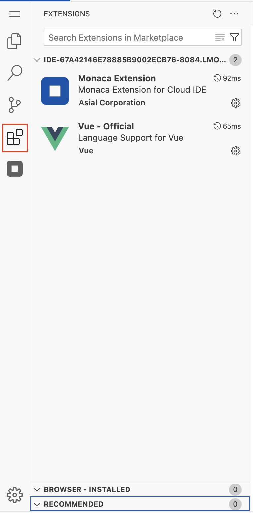
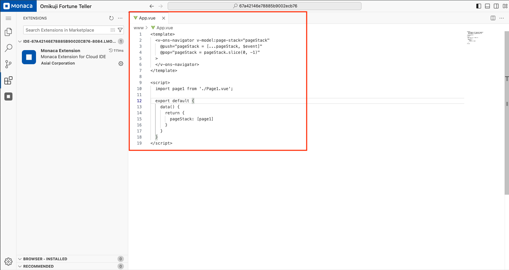
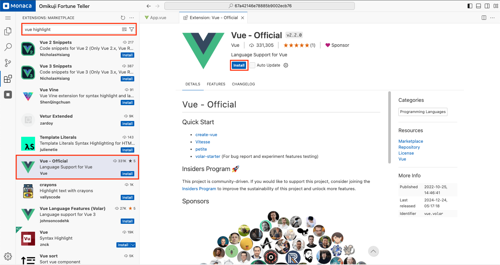
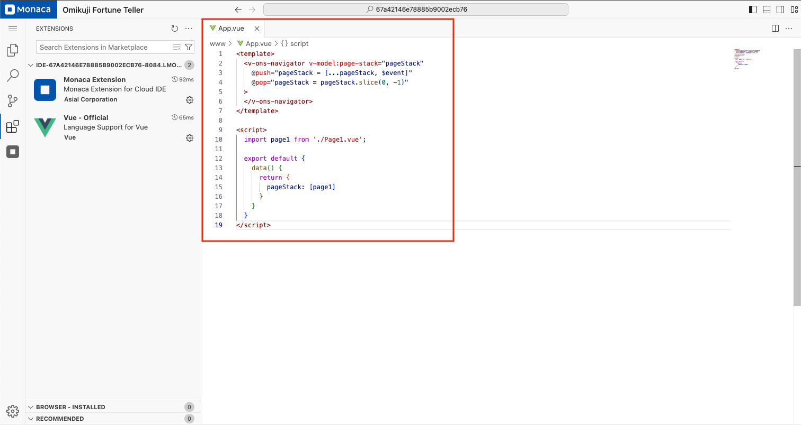

# Extensions

This section provides basic instructions on how to manage extensions in the new IDE, including installing, enabling, disabling, updating, and uninstalling extensions.

---

## 1. Opening the Extensions Marketplace

To manage extensions, follow these steps:

1. Click on the **Extensions** icon in the **Activity Bar** (left sidebar).  
2. The **Extensions Marketplace** will open, displaying a list of installed extensions.

---

## 2. Installing an Extension

1. Open the **Extensions Marketplace**.  
2. Use the **Search Bar** at the top to find the desired extension.  
3. Click on the extension from the search results.  
4. Click **"Install"** to install the extension.  
5. The installation progress will be displayed, and once completed, the extension will be available for use.

---

## 3. Enabling and Disabling Extensions

### Enable an Extension

1. Open the **Extensions Marketplace**.  
2. Locate the extension under **Installed** extensions.  
3. Click **"Enable"** if the extension is disabled.  
4. The extension will now be active.

### Disable an Extension

1. Open the **Extensions Marketplace**.  
2. Locate the extension under **Installed** extensions.  
3. Click **"Disable"** to deactivate the extension.  
4. The extension will be disabled but not removed.

---

## 4. Updating an Extension

1. Open the **Extensions Marketplace**.  
2. Check if any installed extensions have an **"Update"** button next to them.  
3. Click **"Update"** to install the latest version.  
4. The extension will be updated automatically.

---

## 5. Uninstalling an Extension

1. Open the **Extensions Marketplace**.  
2. Locate the extension under **Installed** extensions.  
3. Click **"Uninstall"**.  
4. The extension will be removed from the IDE.

---

## Example: Enabling Syntax Highlighting for Vue Files

In this example, we will enable the **"Vue - Official"** extension to enable syntax highlighting for Vue files.

By default, the IDE only provides syntax highlighting for basic file types such as **HTML, CSS, and JavaScript**. If you open a **Vue (`.vue`) file**, syntax highlighting will not be applied.

### Before Installing the Vue Extension

In the screenshot below, the **"App.vue"** file is opened, but the syntax is not highlighted.

### Installing the Vue Extension

To enable syntax highlighting for Vue files, follow these steps:

1. Open the **Extensions Marketplace**.
2. In the search bar, type **"Vue highlight"**.
3. A list of extensions related to Vue will appear.
4. Read the descriptions and choose an extension that provides syntax highlighting.
5. Look for an extension with **high download numbers and positive user feedback** to ensure reliability and security.

In this case, we selected **"Vue - Official"** because it is a trusted extension used by many developers.

### Activating the Extension

1. Click **"Install"** and wait for the installation to complete.
2. Reload the browser to apply the changes.
3. Reopen the Vue file to see the updated syntax highlighting.

### After Installing the Vue Extension

Now, the **Vue syntax highlighting** is properly applied.

---

## Notes

- Always verify the extension details before installing to ensure security and compatibility.
- Some extensions may require a **browser reload** or **IDE restart** to take effect.
- If an extension does not work as expected, try disabling and re-enabling it.
- Certain extensions may not be fully compatible with this IDE.
- Free-plan users may have limitations on available extensions.
