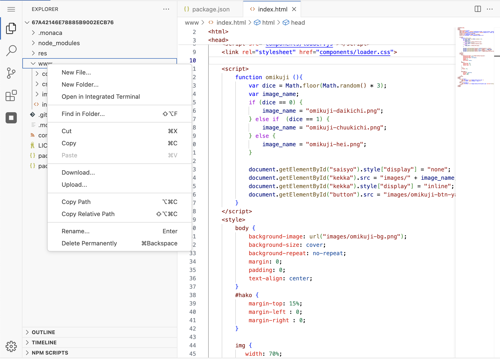

# Basic File Operation

This section provides basic instructions for managing files and folders in the new IDE.

---

## 1. Creating a New File or Folder

### Create a New File

1. Open the **Explorer** panel by clicking on the **file icon** in the Activity Bar (left sidebar).
2. Right-click on the **desired directory** where you want to create the file.
3. Select **New File**.
4. Enter the file name (e.g., `index.html`, `script.js`).
5. Press **Enter** to create the file.

### Create a New Folder

1. In the **Explorer** panel, right-click on the **desired directory**.
2. Select **New Folder**.
3. Enter the folder name.
4. Press **Enter** to create the folder.

---

## 2. Opening a File

1. Open the **Explorer** panel.
2. Click on the file you want to open.
3. The file will open in a new tab in the editor.

---

## 3. Editing and Saving a File

### Edit a File

1. Open the file in the editor.
2. Click inside the file and start editing.

### Save Changes

- Press **`Ctrl + S`** (Windows/Linux) or **`Cmd + S`** (Mac).
- Alternatively, go to **File > Save** from the menu.

---

## 4. Deleting a File or Folder

1. Open the **Explorer** panel.
2. Right-click on the **file or folder** you want to delete.
3. Select **Delete**.
4. Confirm the deletion when prompted.

---

## 5. Renaming a File or Folder

1. Open the **Explorer** panel.
2. Right-click on the **file or folder** you want to rename.
3. Select **Rename**.
4. Enter the new name and press **Enter**.

---

## 6. Downloading a File

1. Open the **Explorer** panel.
2. Right-click on the file you want to download.
3. Select **Download**.
4. The file will be downloaded to your local system.

---

## 7. Uploading a File

1. Open the **Explorer** panel.
2. Click the **Upload Files** button (or right-click on a folder and select **Upload Files**).
3. Select the file from your local computer.
4. The file will be uploaded to the selected directory.

---

## 8. Moving Files and Folders

1. Open the **Explorer** panel.
2. Click and drag the file or folder to a new location.
3. Drop it in the desired directory.

---

## 9. Copying Files and Folders

1. Open the **Explorer** panel.
2. Right-click on the file or folder.
3. Select **Copy**.
4. Right-click on the target directory and select **Paste**.

---

## 10. Searching for a File

1. Press **`Ctrl + P`** (Windows/Linux) or **`Cmd + P`** (Mac).
2. Type the file name.
3. Select the file from the search results to open it.

---

## Notes

- Some features may be restricted based on user permissions or plan limitations.
- Use **`Ctrl + Z`** (Windows/Linux) or **`Cmd + Z`** (Mac) to undo changes before saving.
- Use the integrated **terminal** for advanced file operations (e.g., `mv`, `cp`, `rm` commands).
- This manual just cover some basic file operations. There are more functions provided by the IDE. If you can't find any specific operation or function you wish to perform, please contact our support team.
