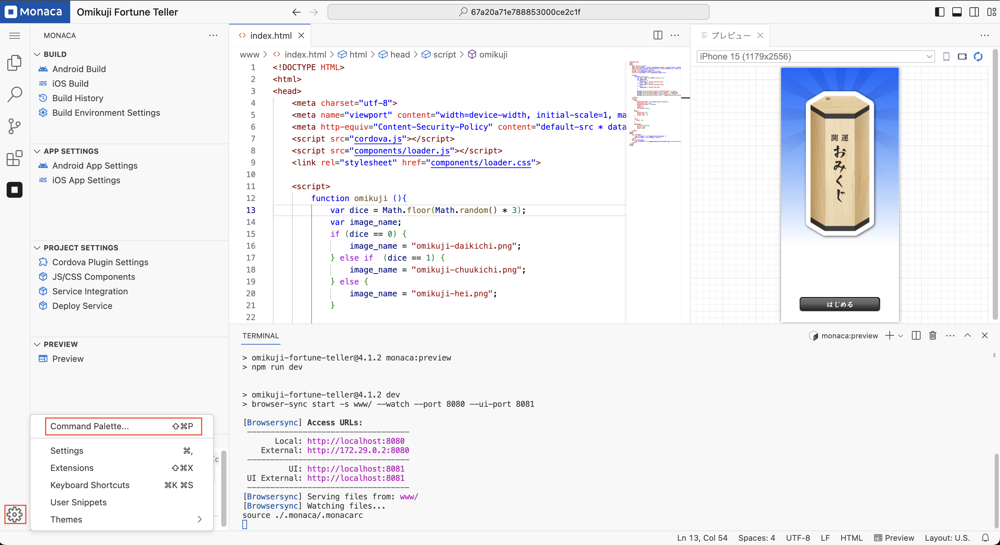
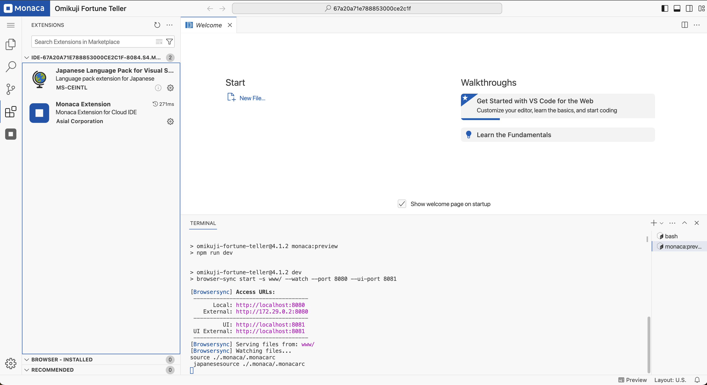

# Switching Language

This guide provides step-by-step instructions on how to switch between supported languages in the IDE. Currently, the IDE supports **English** and **Japanese**.

---

## Prerequisites

By default, the new IDE only supports the **English** language. To use **Japanese**, you need to install the **Japanese Language Pack** extension. This installation is required only once. Once installed, you can switch between English and Japanese as needed.

---

## Japanese Language Extension

When you open a project in the new IDE for the first time, the system will check if the **Japanese Language Pack** is installed. If it is not installed, the system will attempt to install it automatically, as shown in the screenshot below.

You can view the installation logs under the **Terminal** tab.

If the installation is successful, a pop-up dialog will appear in the bottom-right corner. Click **"Change Language and Restart"** to reload the IDE and apply the Japanese language setting.

**Note:**  

- For **Free Plan** users, the Japanese Language Pack will be installed every time the IDE is opened.  

- For **Paid Plan** users, the extension is installed once and stored in the user’s home directory.

---

## Manual Installation

If the automatic installation fails, follow these steps to install the **Japanese Language Pack** manually:

1. **Open the Extensions View**  
   - Click the **Extensions** icon on the Activity Bar.  
   - A list of installed extensions will be displayed. By default, you should see **Monaca Extension** listed.

   

2. **Search for the Japanese Language Extension**  
   - If the **Japanese Language Pack** is not listed, use the search bar and type:  
     **Japanese Language Pack for Visual Studio Code**.

   

3. **Install the Extension**  
   - Click the **Install** button to install the extension.  
   - Once installed (either manually or automatically), the Japanese Language Pack will appear under the **installed extensions list**.

   

   - The extension’s detail page will display an **Uninstall** button, indicating that the installation was successful.

---

## Switching Languages

### Switching from English to Japanese

1. **Open the Command Palette**  
   - Click the **Settings** icon in the bottom-left corner.  
   - Select **Command Palette...** from the menu.

   

2. **Search for the Language Configuration Command**  
   - In the **Command Palette** search box, type **Configure Display Language**.  
   - Press **Enter** or click the relevant search result.

   

3. **Select "日本語 (ja)"**  

   

4. **Restart the IDE**  
   - Click **"Restart"** to apply the language change.

   

5. **The IDE will reload and switch to Japanese.**  

   

---

### Switching from Japanese to English

1. **Open the Command Palette**  
   - Click the **Settings** icon in the bottom-left corner.  
   - Select **コマンドパレット...** from the menu.

   

2. **Search for the Language Configuration Command**  
   - In the **Command Palette** search box, type **表示言語を構成する**.  
   - Press **Enter** or click the relevant search result.

   

3. **Select "English (en)"**  

   

4. **Restart the IDE**  
   - Click **"再起動"** to confirm.

   

5. **The IDE will reload and switch to English.**  

   

---

## Notes

- The Japanese Language Pack must be installed before switching to Japanese.
- The **Free Plan** requires reinstallation of the language pack every time the new IDE is opened.
- The **Paid Plan** allows the extension to remain installed permanently.
- If you experience any issues, please contact support.
