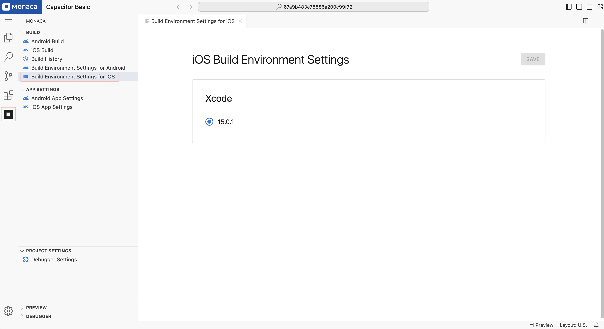

# iOS Build Environment Setting

You can set the environment settings for building Capacitor iOS applications. The settings are project-specific.

1. Open the **Build Environment Settings for iOS** page:  
   - Click the **Monaca** icon in the **Activity Bar**.  
   - Under the **"Build"** section, select **Build Environment Settings for iOS**.

2. The page will appear as shown below. You can then start your configuration.

3. After finishing the configuration, click **"Save"**.

  

    - **Xcode Version:**  
        - Select the Xcode version used for compiling the iOS application.

---

## Notes

- This page is only for Capacitor projects.
- Some settings may vary depending on the Capacitor version.
