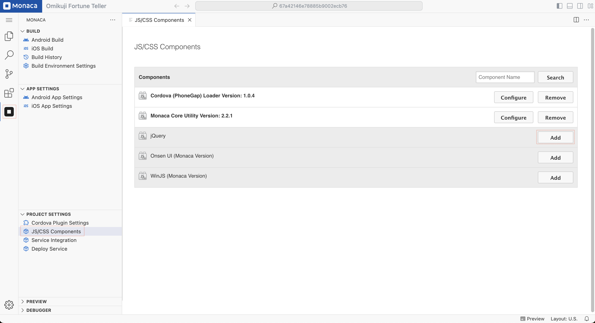
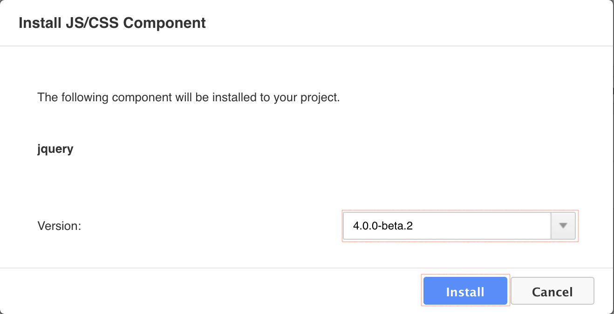
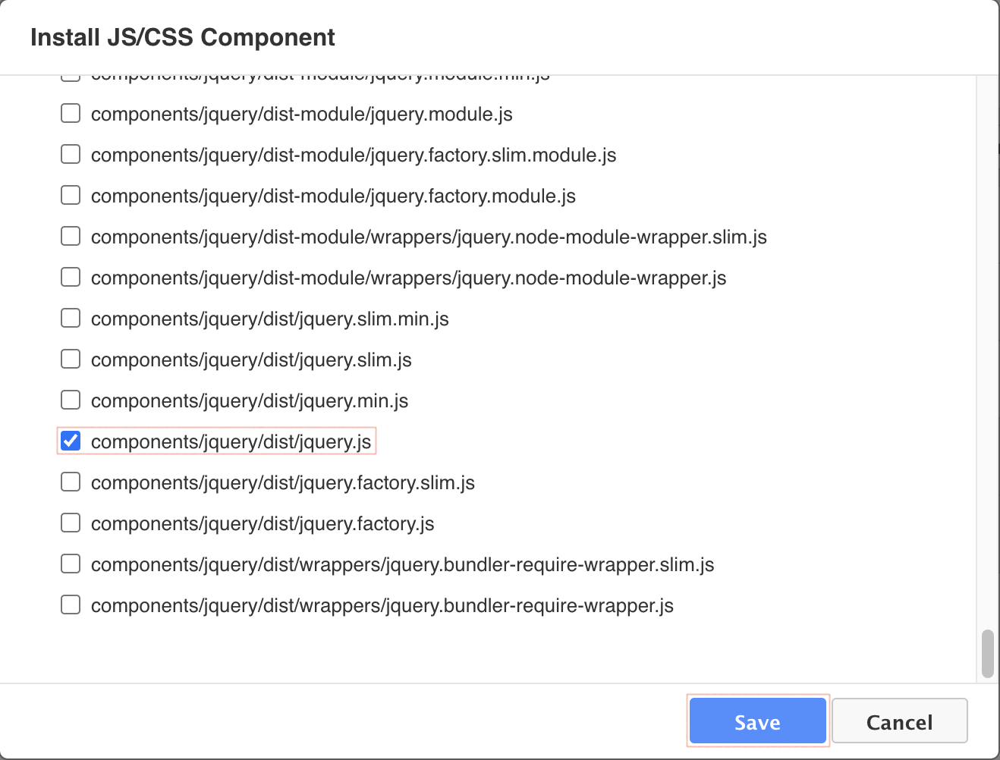
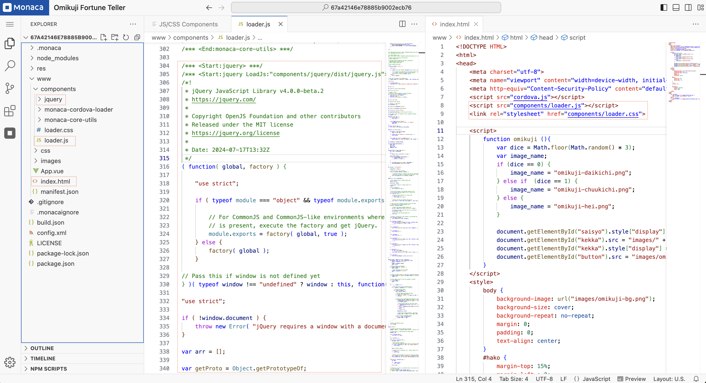

# JS/CSS Components

JS/CSS components are **JavaScript** and **CSS** libraries that you may need to include in your project, such as **jQuery, jQuery Mobile, and Onsen UI**.

To add a **JavaScript/CSS** library, follow these steps:

---

## 1. Opening the JS/CSS Components Page

1. Click the **Monaca** icon in the **Activity Bar**.  
2. Under the **"Project Settings"** section, select **"JS/CSS Components"**.

---

## 2. Searching for a Library

1. The **JS/CSS Components** page displays a list of available libraries.
2. If you cannot find the library you need, use the **search box** to locate it.

   

---

## 3. Adding a Library

1. Once you have selected a library, click the **"Add"** button to include it in your project.  
2. For example, selecting **`jQuery`** will prompt you to choose the version to install.

   

---

## 4. Selecting Files

1. Choose the specific files from the library that you want to include.  
2. Click **"Save"** to confirm your selection.

   

---

## 5. Managing Added Libraries

When a library is added, its files are stored in the **`www/components`** folder. Additionally, the following files will be automatically updated:

| File Name    | Description                                                     |
| ------------ | --------------------------------------------------------------- |
| `loader.js`  | A JavaScript file used by Monaca to load JavaScript libraries.  |
| `loader.css` | A CSS file used by Monaca to load stylesheets.                  |

These files allow libraries to be loaded automatically. You only need to reference **`loader.js`** and **`loader.css`** in your HTML file.

   
