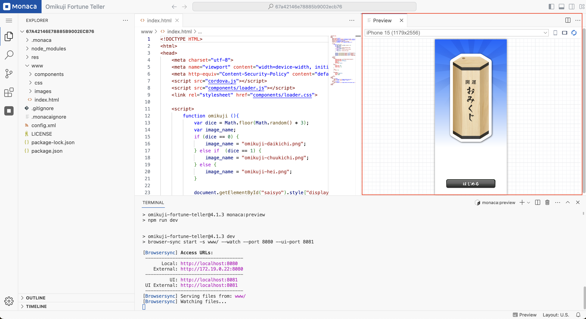
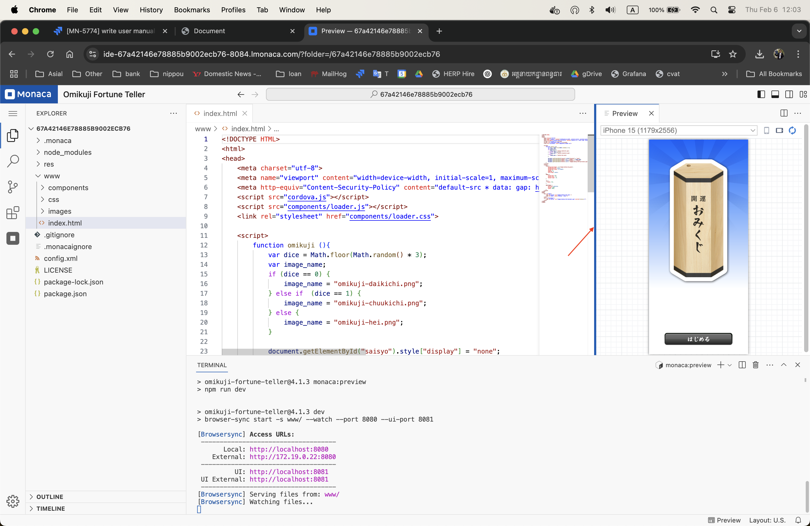
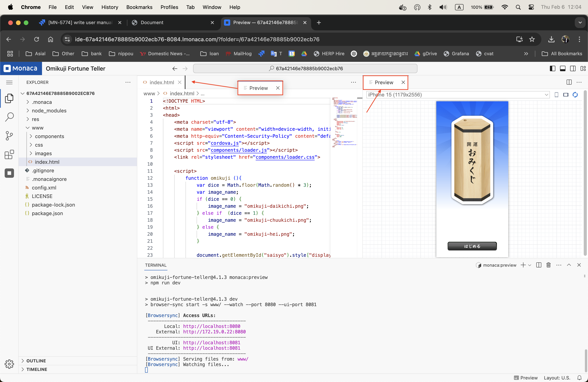
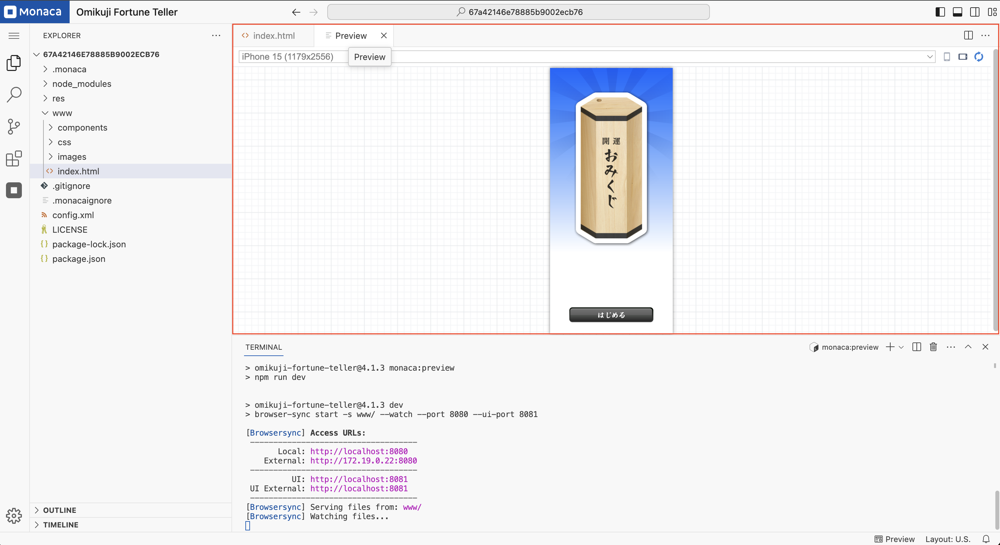
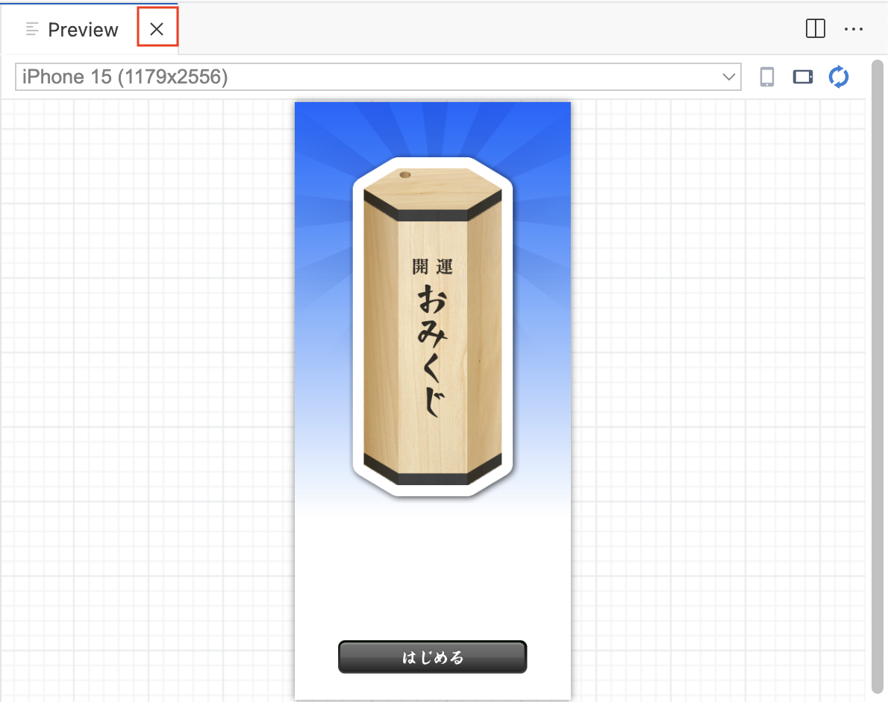
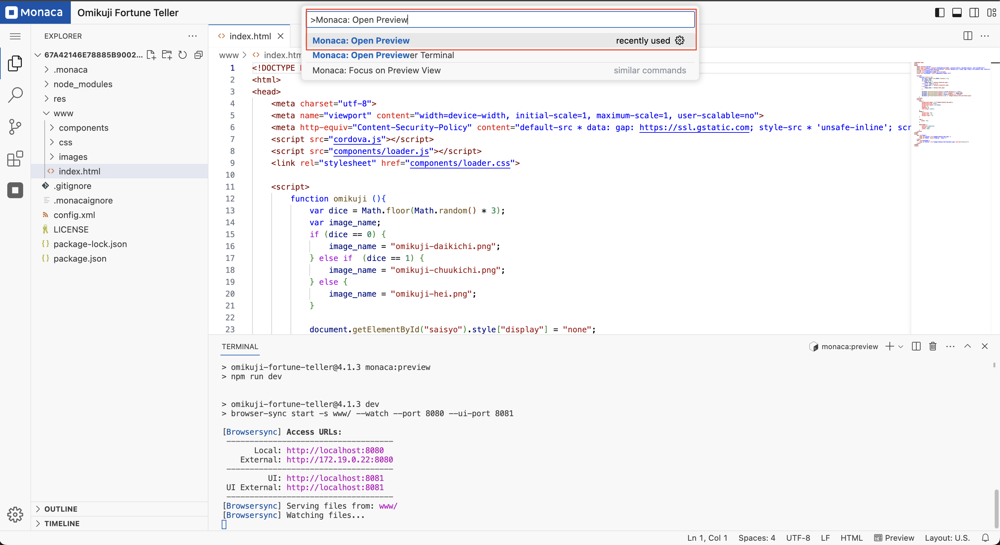
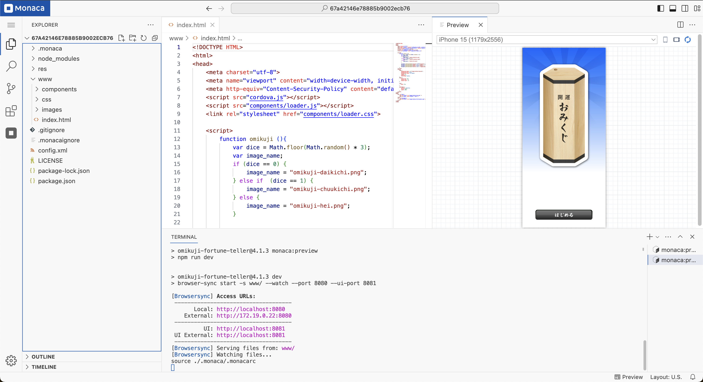
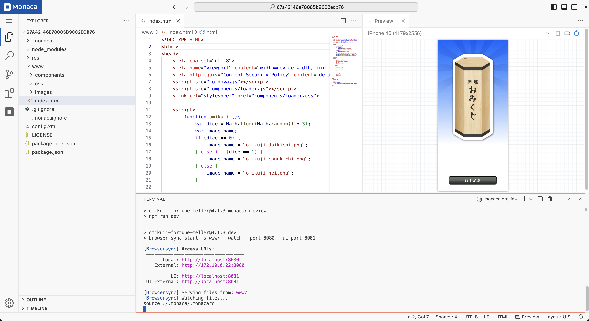

# Project Previewer

This section provides instructions on how to manage the project previewer, including resizing, repositioning, opening, and closing it.

---

## Layout

By default, the previewer is displayed on the **right side** of the editor group.

### Resizing the Previewer

You can resize the previewer by moving your cursor to the **left edge** of the panel. Click and drag it **left or right** to adjust its size.

### Moving the Previewer

The previewer can be repositioned anywhere within the editor group. For example, you can move it next to the file tab (e.g., `index.html`).

1. Click on the **"Preview"** tab.
2. Hold down the mouse button and drag it to your desired position.  
   _(In this example, we move it next to the file tab.)_

After repositioning, it may appear as follows:

---

## Opening and Closing the Previewer

### Closing the Previewer

If you no longer need the previewer, you can close it by clicking the **"X"** icon.

### Reopening the Previewer

To reopen the previewer:

1. Open the **Command Palette**.

   

2. Search for **"Monaca: Open Preview"** and select it.

   

3. The preview tab will be restored in the editor group.

   

---

## Notes

- The previewer **displays** and **live-reloads** the preview content of your project as you modify the source code.
- If the previewer does not display content properly or encounters errors, check the **Preview Terminal** tab at the bottom of the IDE.
- The behavior of the previewer may vary depending on the project.

  
