# Source Control (GitHub) - User Manual

This guide provides step-by-step instructions for managing source control in **cloud-based VS Code (code-server)** using **GitHub**.

---

## Prerequisites

Before using GitHub with Monaca, you must first **[link your Monaca account to GitHub](https://monaca.mobi/vcs).**

---

## 1. Committing File Changes

1. Open the **Source Control** panel by clicking the **Git** icon in the **Activity Bar** (left sidebar).
2. Click **Initialize Repository**.

   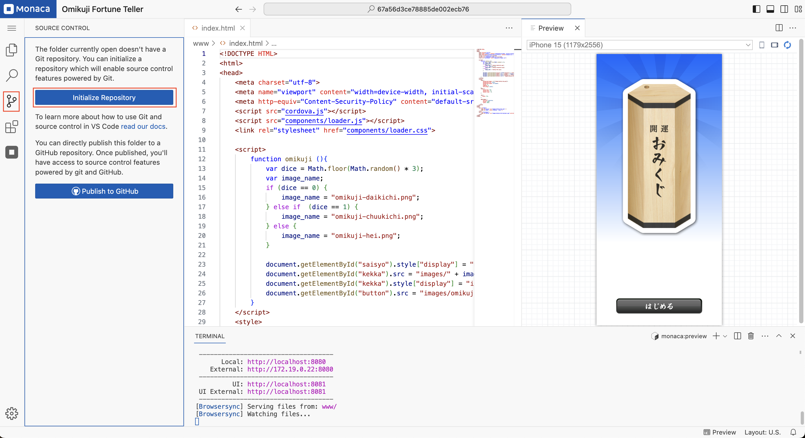

3. Enter a commit message (e.g., `"init"`) and click **Commit**.

   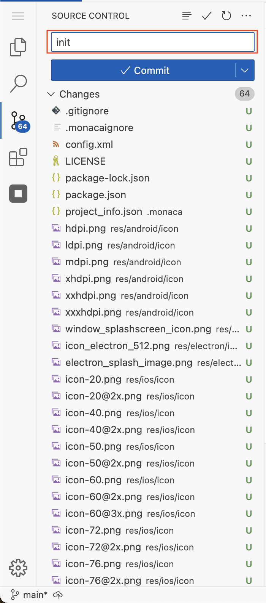

4. In the confirmation dialog, click **Yes** to commit all changes.

   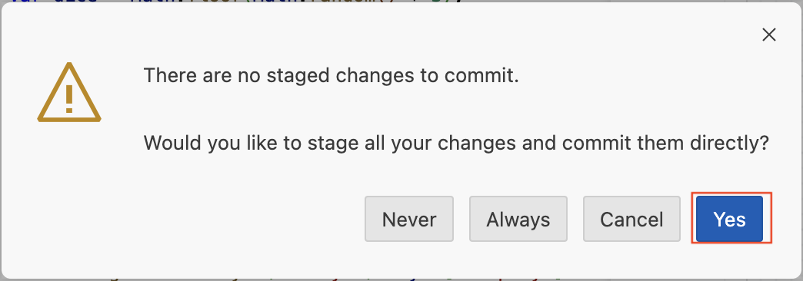

---

## 2. Publishing to a New GitHub Repository

1. Click **Publish Branch** to push the committed changes.

   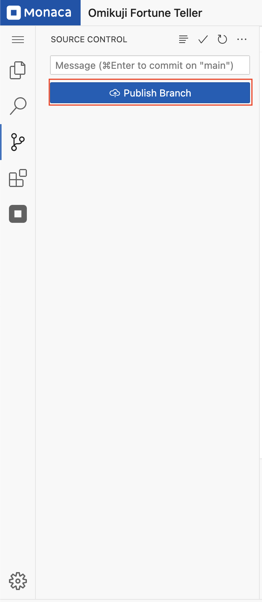

2. If this is your first time using GitHub in the IDE, a sign-in dialog will appear. Click **Allow** to proceed.

   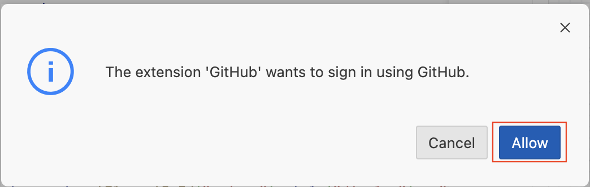

3. Copy the authentication code and click **Copy & Continue to GitHub**.

   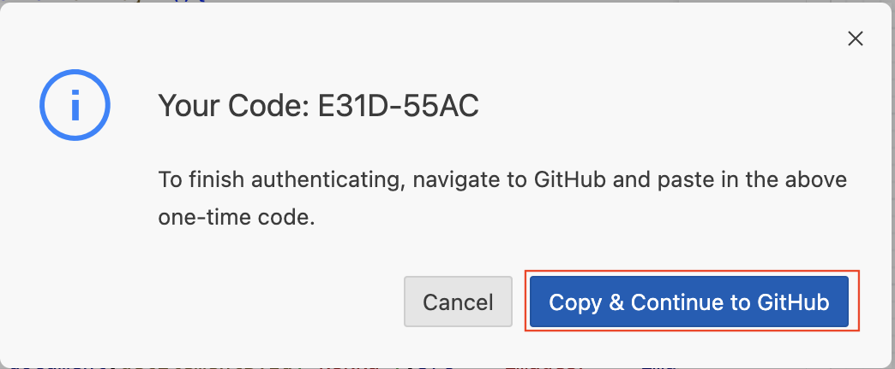

4. A new tab will open. Review your GitHub account details and click **Continue**.

   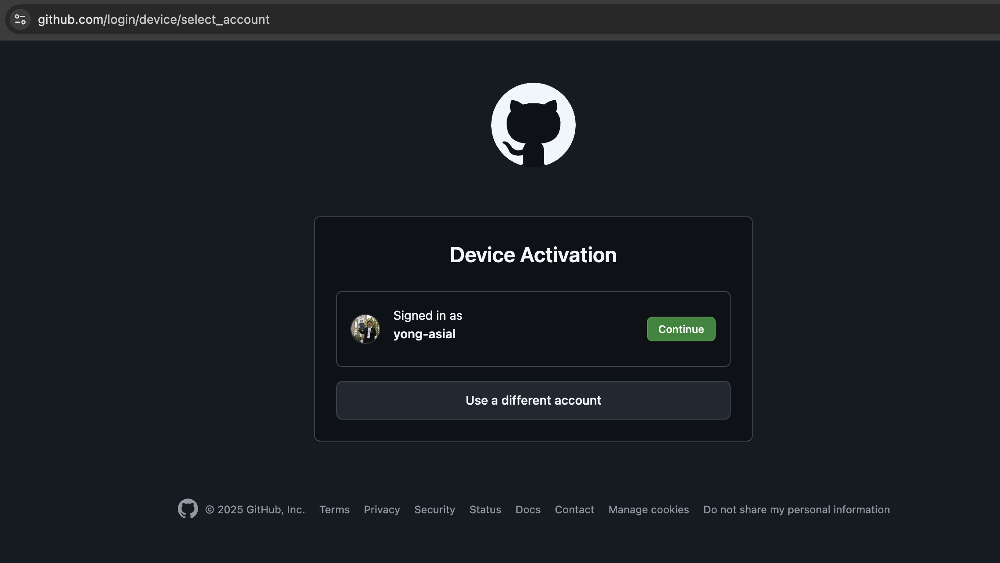

5. Paste the copied authentication code and click **Continue**.

   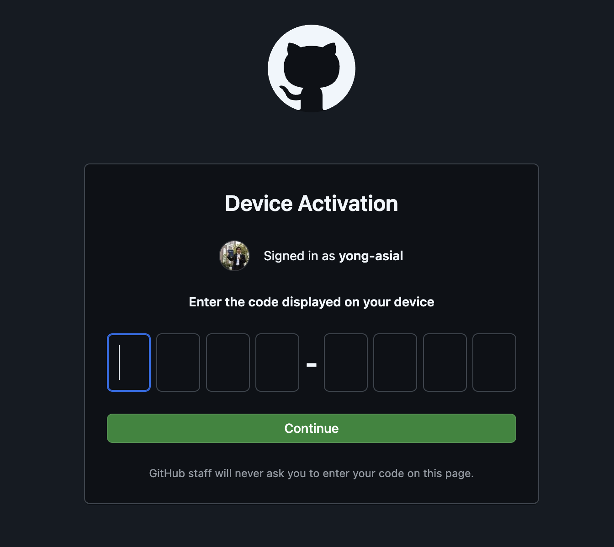

6. Review your GitHub account details and click **Authorize Monaca** to grant access.

   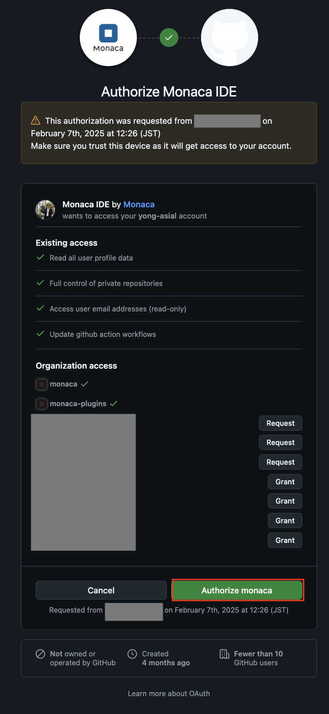

7. Depending on your GitHub authentication settings, a different sign-in page may appear. Choose your preferred authentication method.

   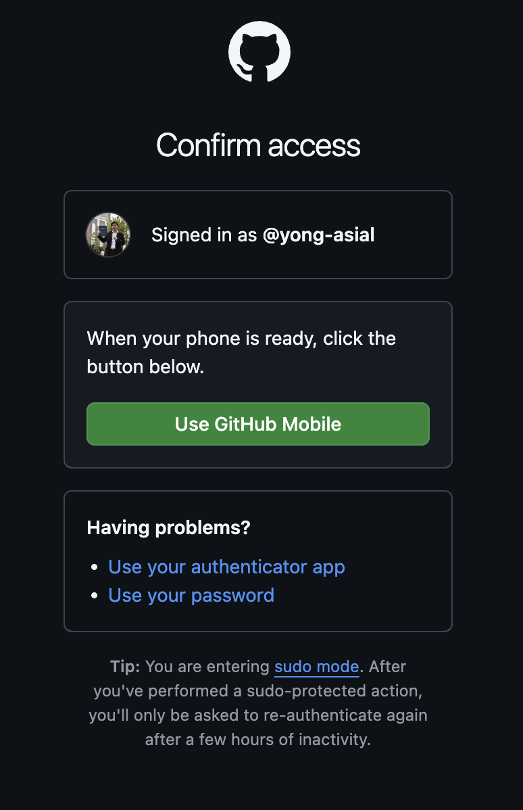

8. If using **GitHub Mobile**, open the GitHub app on your phone and enter the verification code.

   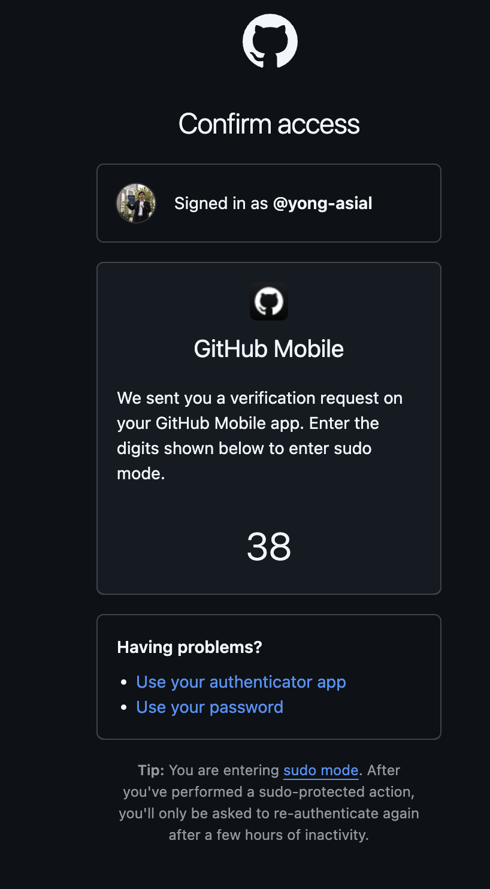

9. Once authentication is successful, you will see a confirmation page. You can close this tab and return to the IDE.

   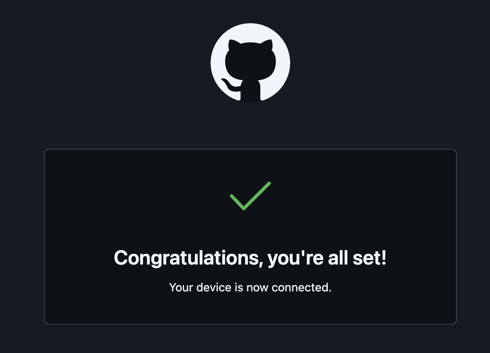

10. The default repository name will be set to the **Project ID**.

   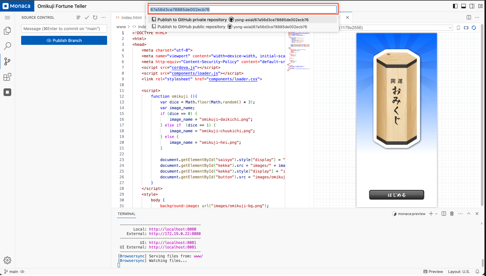

11. You can keep the default name or change it. Select whether to create a **private** or **public** repository.

   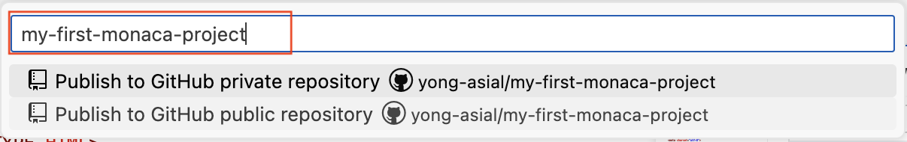

12. Once the repository is successfully created, you will see confirmation messages.  
    - Click **Open on GitHub** to view the repository.  
    - Click **Yes** to enable periodic syncing with the remote repository.

   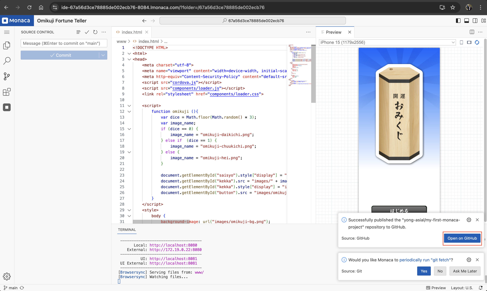

---

## 3. Publishing to an Existing GitHub Repository

Once the GitHub repository is linked to your project, you will not be required to authenticate again.

1. Make modifications to your project.

   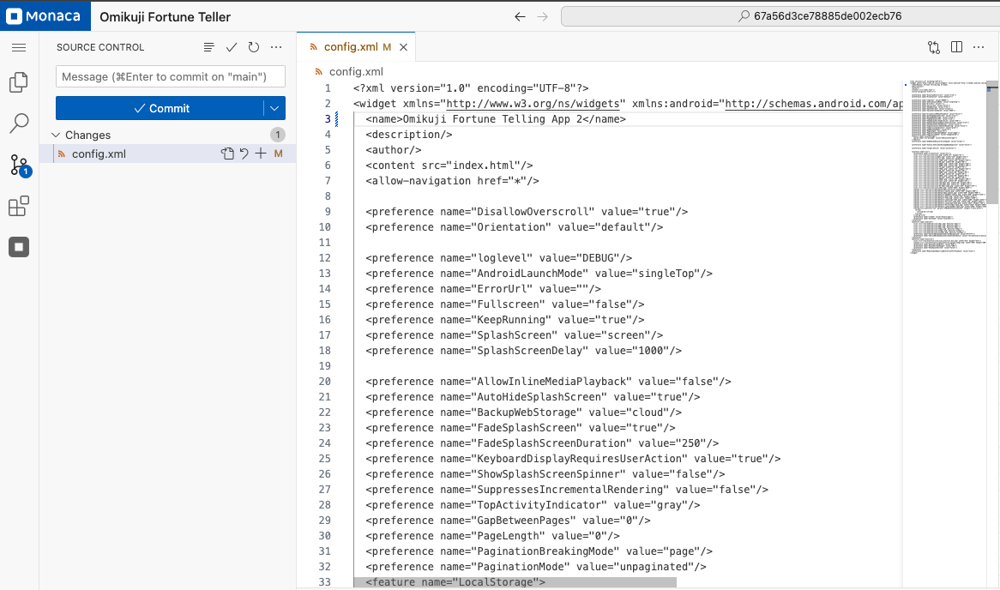

2. Enter a commit message describing the changes and click **Commit**.

   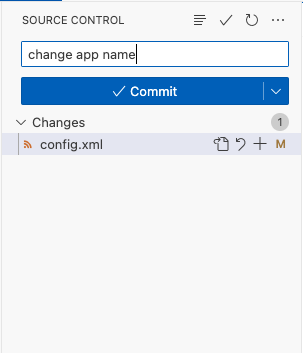

3. Click **Yes** to confirm or **Always** to avoid this confirmation dialog in the future.

   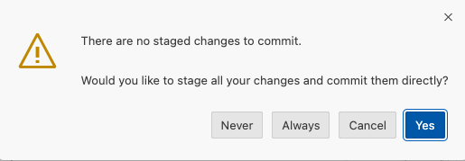

4. Click **Sync Changes** to push the latest commits to the remote repository.

   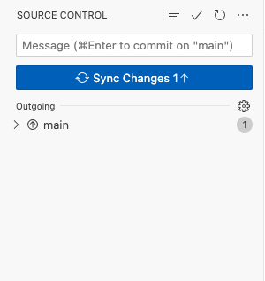

5. Click **OK** to confirm or **OK, Don't Show Again** to disable this confirmation for future syncs.

   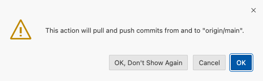

6. Once the changes are successfully pushed, the commit list will be cleared, and the sync button will be disabled.

   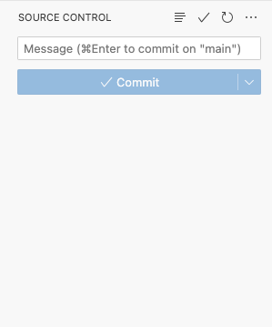

---

## 4. Additional Git Operations

Additional Git operations such as **Pull, Stash, Branch Management, and more** can be accessed by clicking the **menu (hamburger icon)** in the **Source Control** panel.

   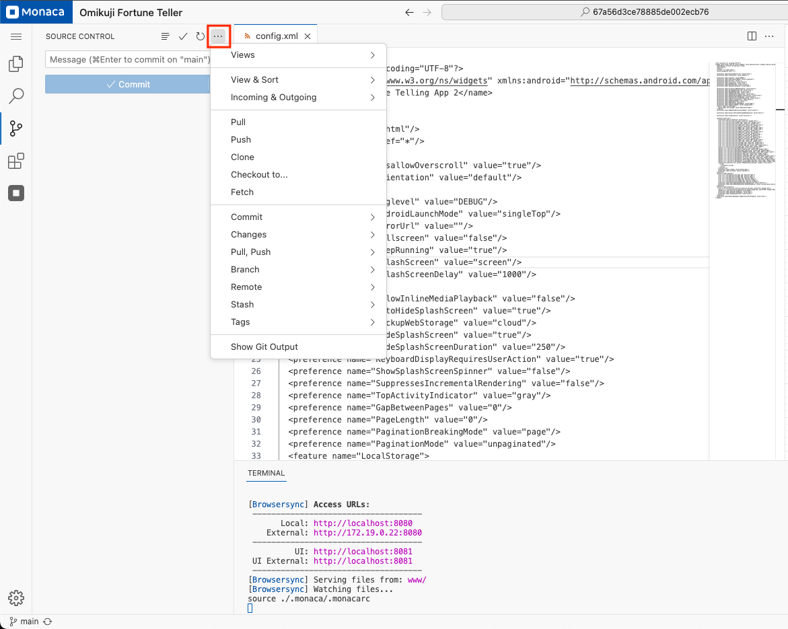

---

## Notes

- Ensure you have **write access** to the repository before committing changes.
- Always **pull the latest changes** before making updates to prevent merge conflicts.
- GitHub authentication steps may vary depending on user settings.
- Some features may be restricted for **free-plan users**.
- **Private repositories** are not available for **free-plan users**.
