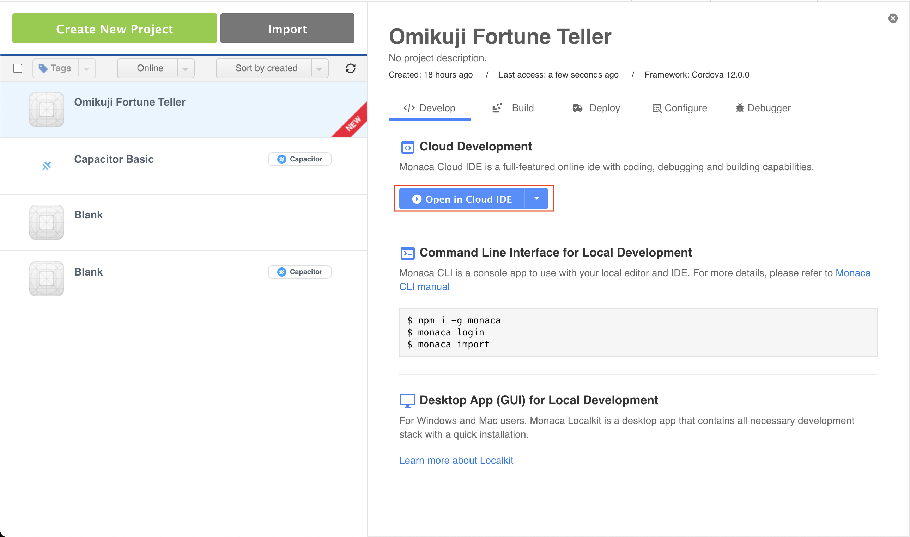
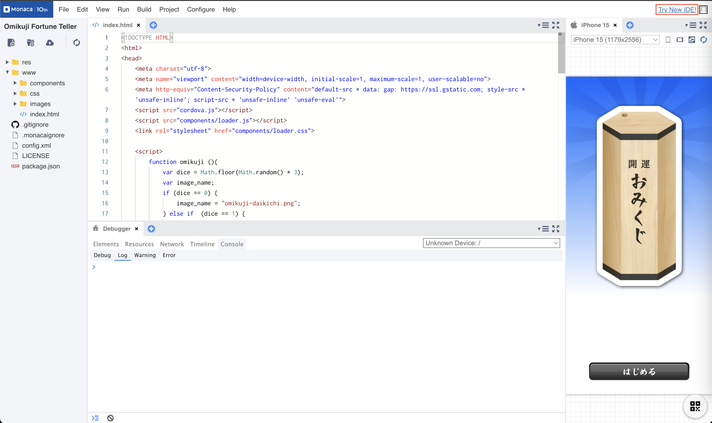
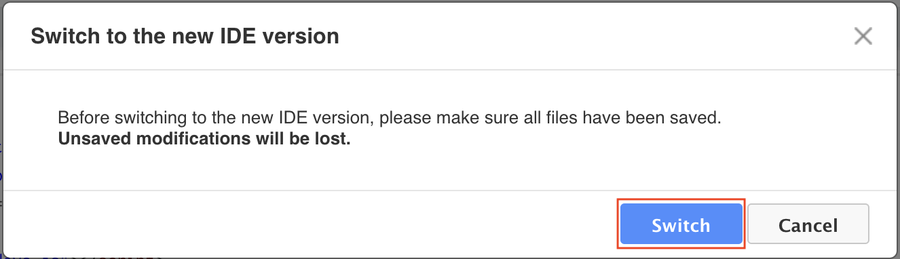
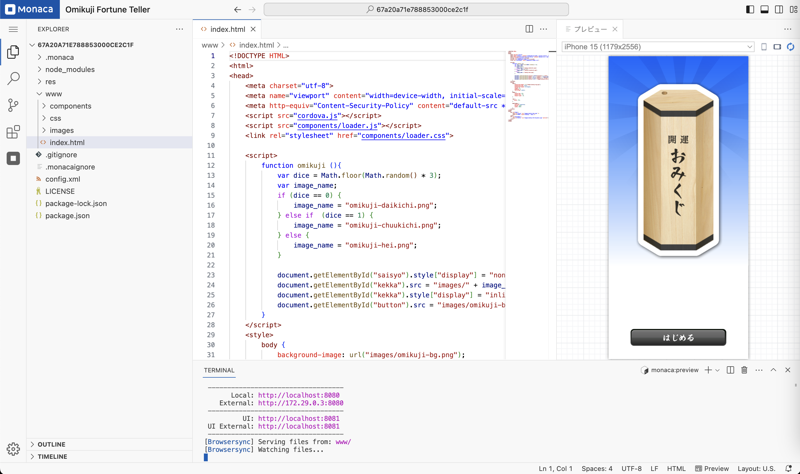
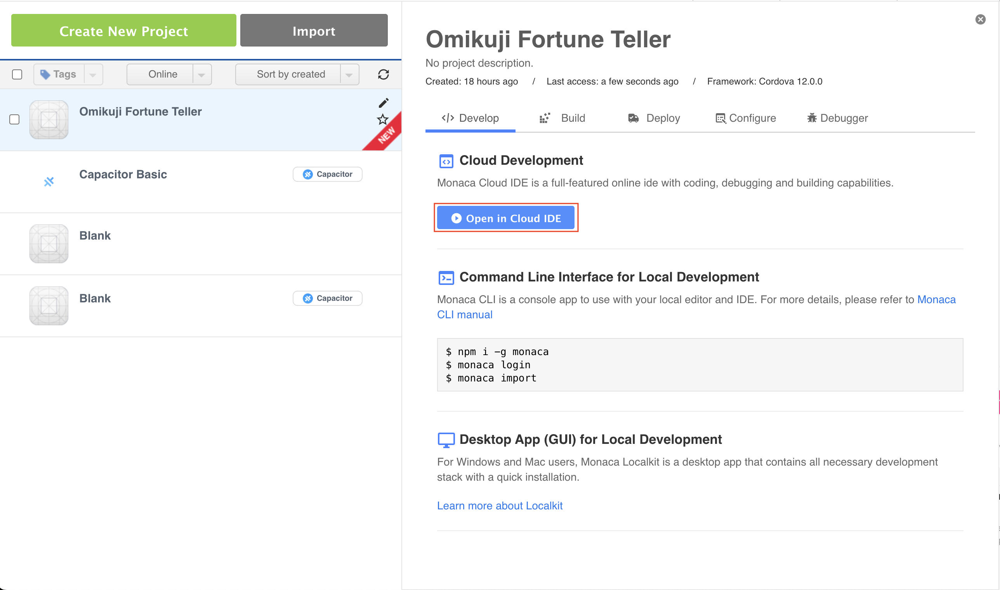
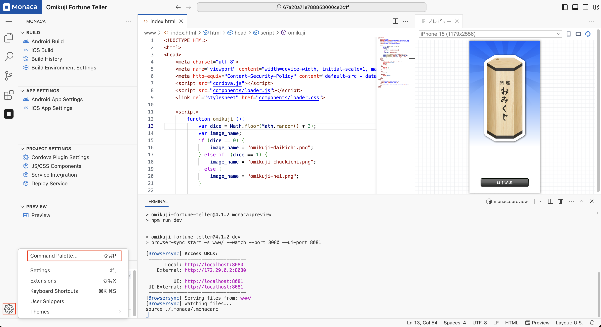
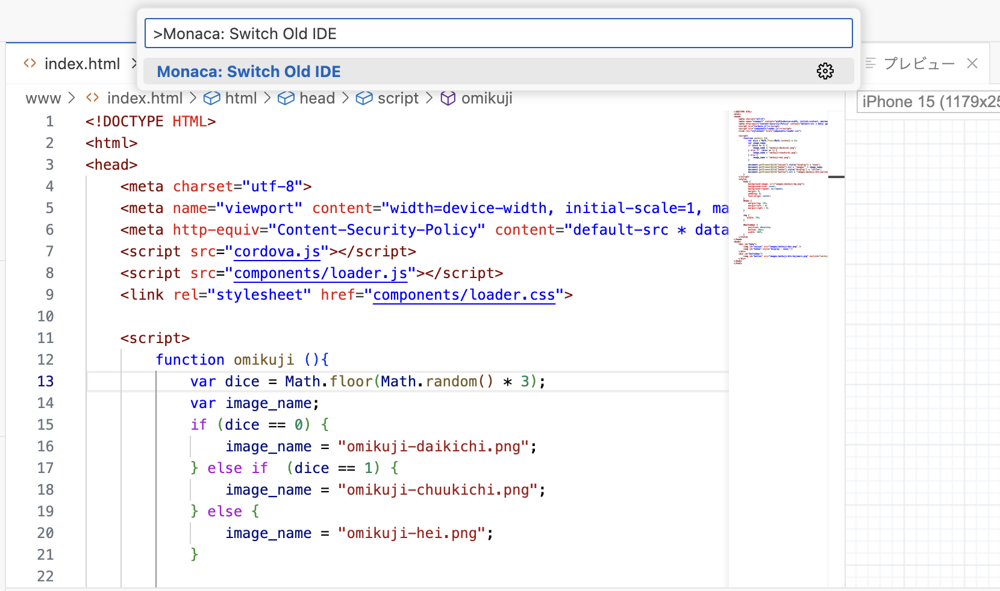
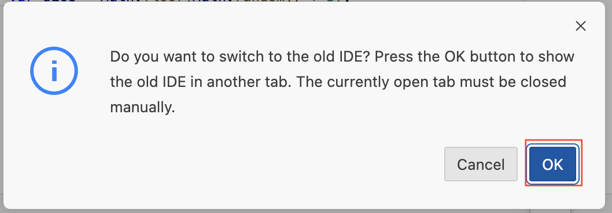
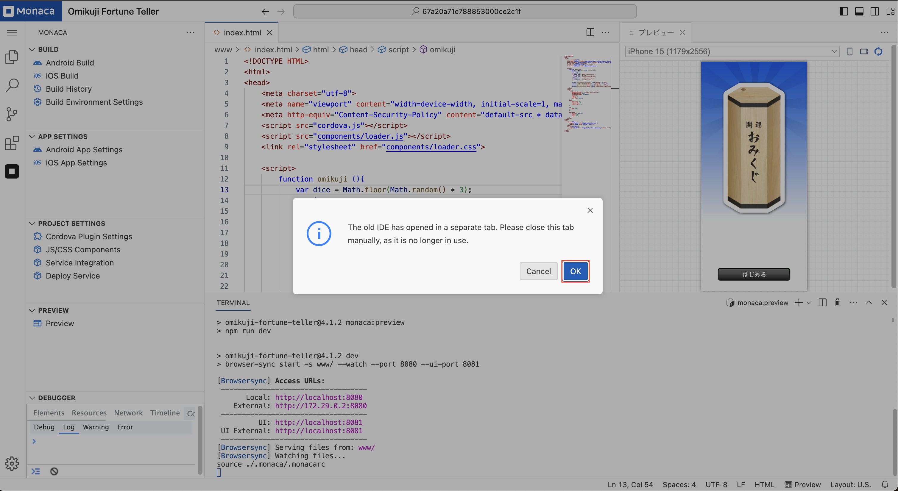
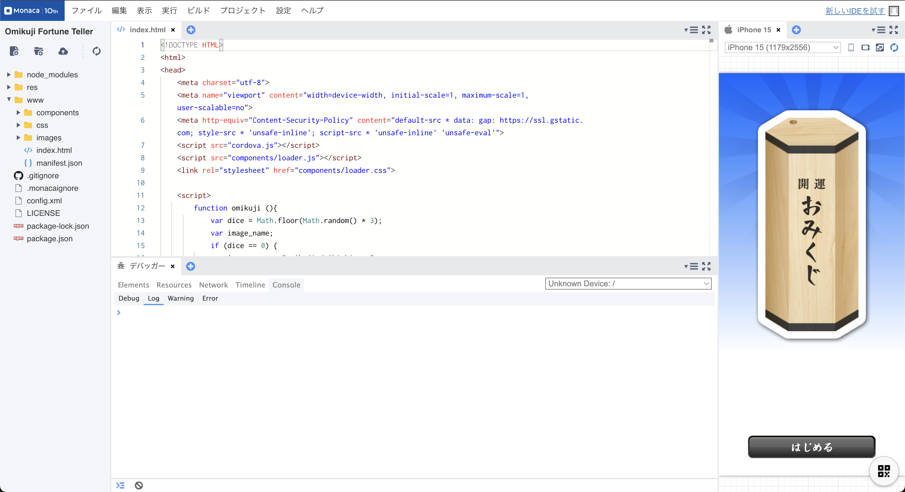

# Switching Between IDE Versions

This guide provides step-by-step instructions on how to switch between the new and old IDE versions.

---

## Switching to the New IDE

Follow these steps to switch to the new IDE:

1. **Open a Project**  
   - Select the project you wish to open.  
   - Click **"Open in Cloud IDE"** to launch the project in current IDE.

   

2. **Locate the "Try New IDE!" Button**  
   - On your current IDE interface, locate the **"Try New IDE!"** button.

3. **Click "Try New IDE!"**  
   - Click the button to initiate the switch to the new IDE.

   

4. **Confirm the Switch**  
   - A confirmation dialog will appear with a **"Switch"** button.  
   - Click **"Switch"** to proceed.

   

5. **Wait for the New IDE to Load**  
   - The system will take a moment to configure and launch the new IDE.  
   - Once the setup is complete, the new IDE interface will be displayed.

   

---

## Switching Back to the Old IDE

To revert to the old IDE, follow these steps:

1. **Open a Project**  
   - Select the project you want to open.  
   - Click **"Open in Cloud IDE"** to launch the project in the new IDE.  

   **Note:** There is no drop-down icon next to the button.

   

2. **Open the Command Palette**  
   - Click the settings icon in the bottom-left corner.  
   - Select **"Command Palette..."** from the menu.

   

3. **Search for the Switch Command**  
   - In the Command Palette search box, type **"Monaca: Switch Old IDE"**.  
   - Press **Enter** or click the relevant search result.

   

4. **Confirm the Switch**  
   - A confirmation dialog will appear with an **"OK"** button.  
   - Click **"OK"** to proceed.

   

5. **Close the Current IDE Tab**  
   - A prompt will appear asking you to close the current IDE tab. Click **"OK"** to dismiss the dialog.  
   - Manually close the tab.

   

6. **Access the Old IDE**  
   - The old IDE will open in a new tab.

   

---

## Notes

- Switching between IDE versions does not affect your files or projects.
- Some features and functionalities may differ between the old and new IDEs.
- If you encounter any issues, please contact support.
