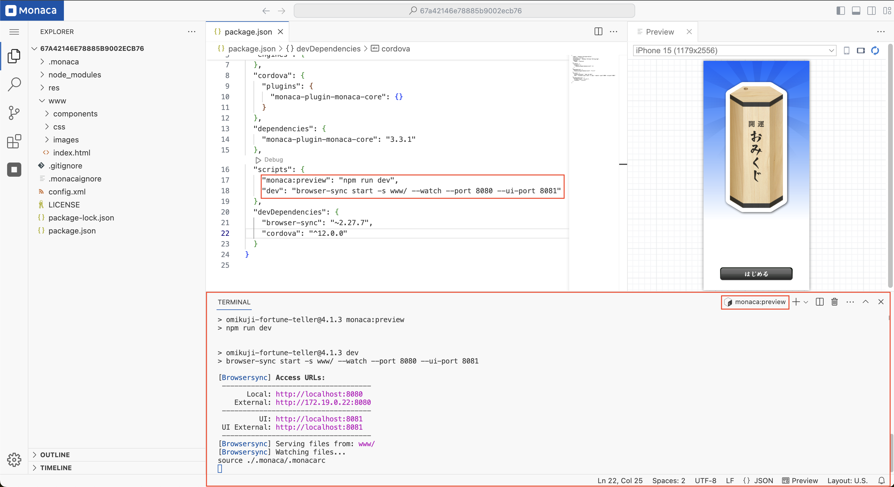
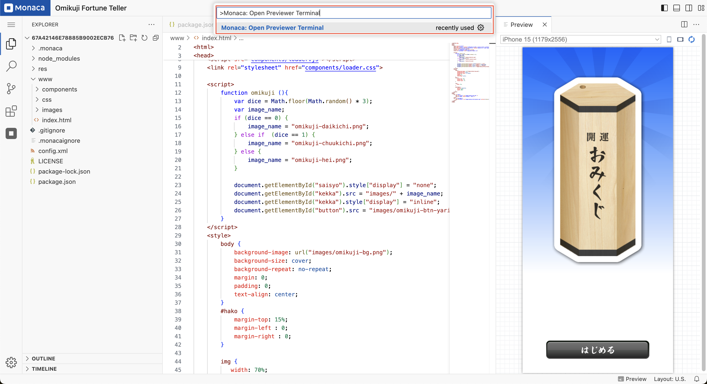
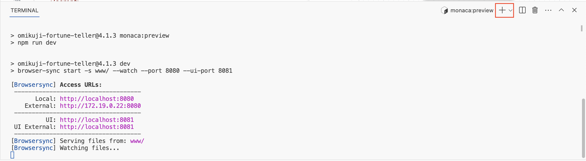
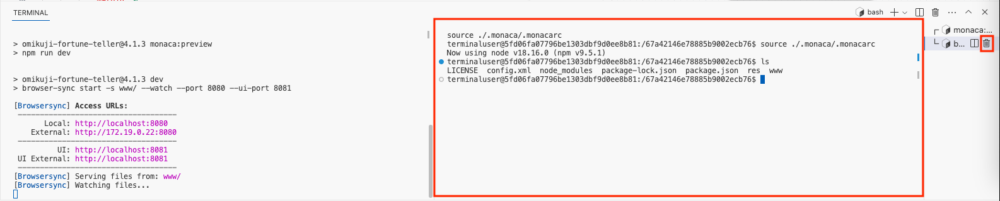

# IDE Terminal

The IDE provides two types of terminals: **Preview Terminal** and **Terminal**.

---

## Preview Terminal

The **Preview Terminal** is a specialized terminal that runs automatically when the IDE starts. It executes the **`monaca:preview`** script, which is defined in the project to create a development server for previewing content.

### Identifying the Preview Terminal

- The **Preview Terminal** can be distinguished from a standard terminal by its title: **monaca:preview**.
- It is recommended to keep the **Preview Terminal** running, as it is essential for providing content to the **previewer**.

### Restarting the Preview Terminal

If the **Preview Terminal** is accidentally closed or fails to start, you can reopen it by following these steps:

1. Open the **Command Palette**.
2. Search for **"Monaca: Open Previewer Terminal"** and select it.

   

---

## Terminal

The standard **Terminal** allows you to execute commands and manage your project environment.

### Creating a New Terminal

To create a new terminal:

1. Click the **"+"** icon in the terminal panel.

   

2. A new **Bash terminal** will be created alongside the existing **Preview Terminal**.

   

### Initial Setup

- When a new terminal is opened, it automatically executes **`.monacarc`** to set up the environment, such as configuring the Node.js version.
- You can run standard **Bash commands** in this terminal.  
  _(Example: Running the `ls` command to list project files and directories.)_

### Deleting a Terminal

To close a terminal:

1. Hover over the terminal title (e.g., **Bash**).
2. Click the **delete (trash bin)** icon.

---

## Notes

- Free-plan users may have certain limitations when using the terminal.
